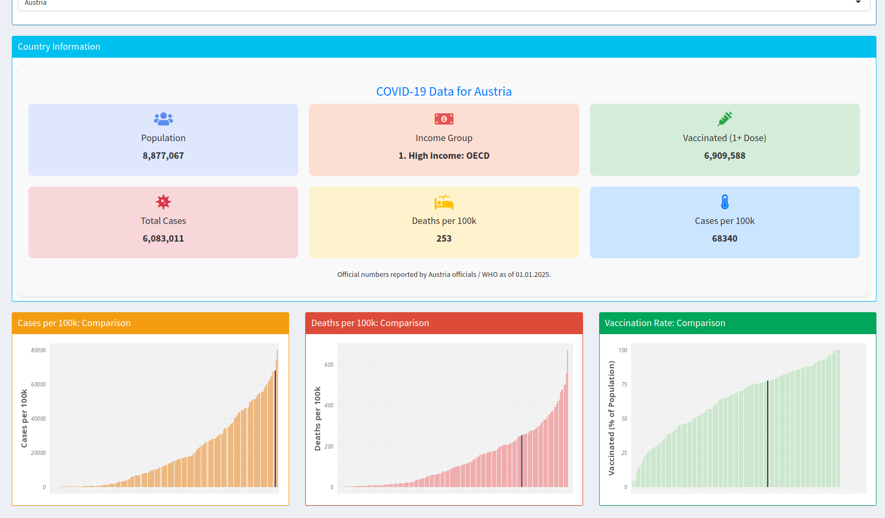
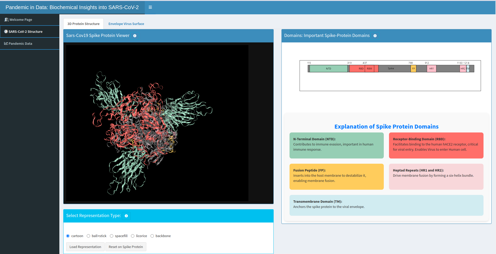
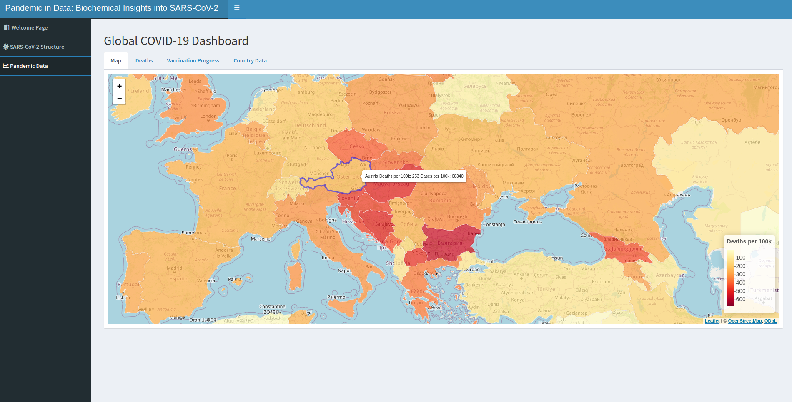

# COVID-19 Protein Dashboard

A fun exploratory project integrating **NGLVieweR** for protein visualization and **Shiny** for interactive dashboards.  
The dashboard presents global WHO COVID-19 data, featuring visualizations of the spike protein and its structural domains.  

---

## Features
- Interactive dashboards built with **Shiny** and **shinydashboard**
- Protein structure visualization with **NGLVieweR**, **rgl**, and **bio3d**
- Mapping and geospatial data with **sf**, **leaflet**, and **rnaturalearth**
- Data wrangling and plotting with **dplyr** and **ggplot2**

---

## Screenshots

### Dashboard Overview


### Spike Protein Visualization


### Global COVID-19 Data Map



---
## Installation

### 1. Clone this repository  

### 2. Install packages (I recommend pacman):  
```r
if (!requireNamespace("pacman", quietly = TRUE)) install.packages("pacman")

pacman::p_load(
  shiny, shinydashboard, bio3d, NGLVieweR, rgl, Rvcg,
  shinycssloaders, assertthat, sf, leaflet, maps,
  rnaturalearth, dplyr, ggplot2
)
```
### 3. Adapt working directory path
